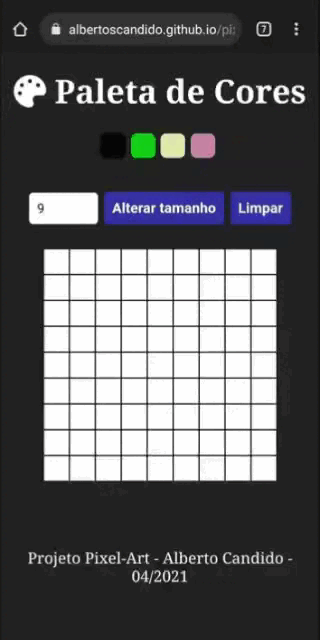

# pixel-art

## Descrição do Projeto

Uma página web que contém uma paleta de cores funcional que pode ser utilizada para criar desenhos em pixels.

<h1 align="center">  <a href="https://albertoscandido.github.io/pixel-art/">🔗 Link do projeto</a>  </h1>  
🚀 #VQV

# Sumário

  <a href="#objetivos">Objetivos</a> •  <a href="#tecnologias">Tecnologias</a>  • <a href="#desenvolvedor">Desenvolvedor</a>  

 

## Demonstração da aplicação

## Objetivos
Esse projeto foi desenvolvido visando desenvolver um jogo de desenho com pixels, utilizando apenas JS, HTML e CSS. Nesse aplicação é possível dimensionar uma paleta e desenhar sobre ela com cores aleatórias que são geradas ao carregar a página!

## Tecnologias

- JS
- HTML
- CSS

 

### Habilidades

-   Manipular o DOM
-   Exercitar o desenvolvimento com JavaScript

 
 

## Desenvolvedor

<a href="https://github.com/albertoscandido">**Alberto Candido**</a>
